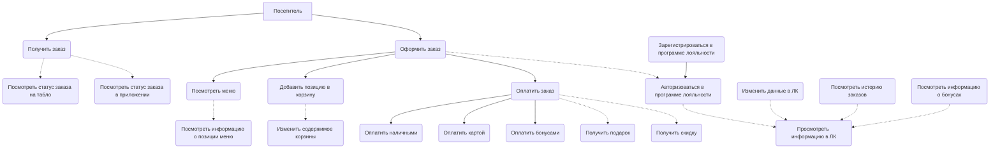

```mermaid
graph TD
    A[Посетитель] --> B(Получить заказ)
    A --> C(Оформить заказ)

    C --> D(Посмотреть меню)
    C --> E(Добавить позицию в корзину)
    C --> F(Оплатить заказ)

    F --> G(Оплатить наличными)
    F --> H(Оплатить картой)
    F --> I(Оплатить бонусами)

    F -.-> J(Получить подарок)
    F -.-> K(Получить скидку)

    B -.-> L(Посмотреть статус заказа на табло)
    B -.-> M(Посмотреть статус заказа в приложении)

    D -.-> N(Посмотреть информацию о позиции меню)
    E -.-> O(Изменить содержимое корзины)
   
    C -.-> P(Авторизоваться в программе лояльности)
    Q(Зарегистрироваться в программе лояльности) --> P

    P -.-> R(Просмотреть информацию в ЛК)
    S(Изменить данные в ЛК) -.-> R
    T(Посмотреть историю заказов) -.-> R
    U(Посмотреть информацию о бонусах) -.-> R
```
